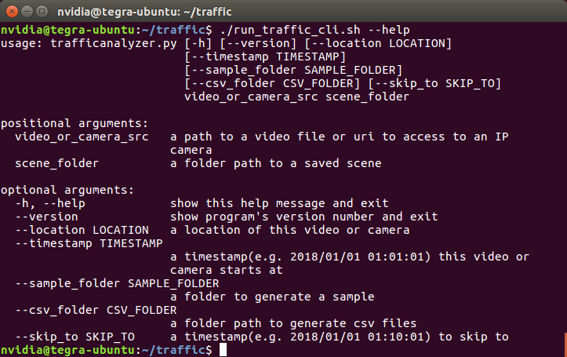
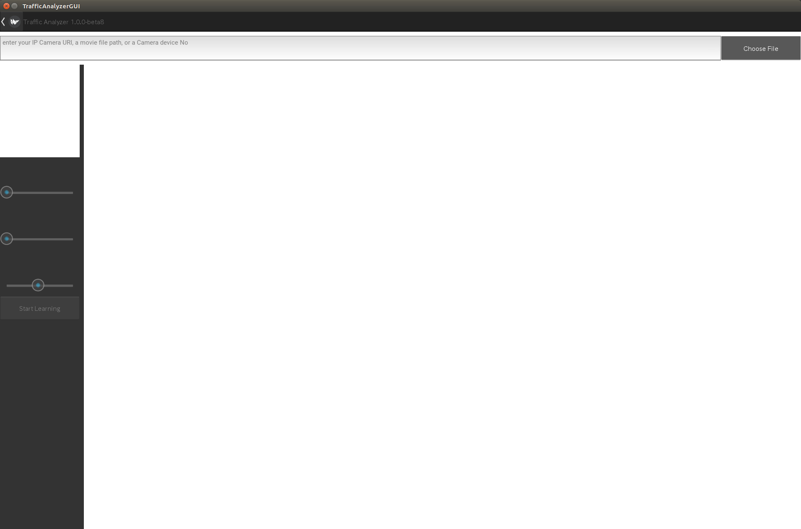
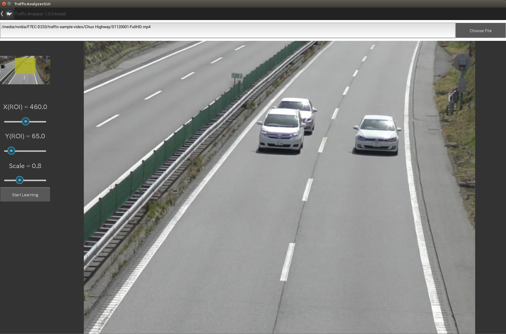
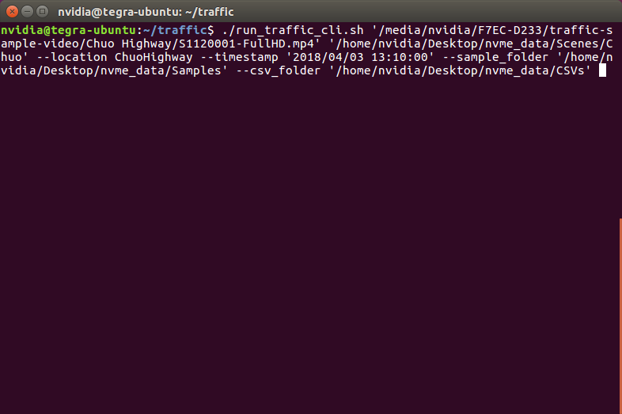
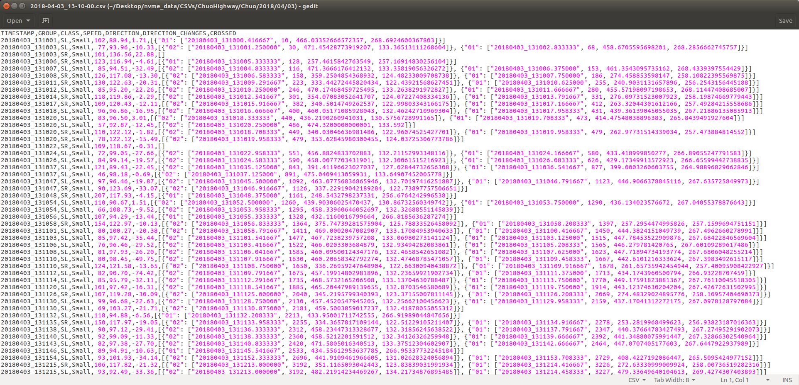

第1章　交通量計測システム概要
==============================

この章では、交通量計測システムの概要について、ハードウェア構成、ソフトウェア構成、そしてクイックスタートの順に説明します。

交通量計測システムは、クラウディアンAI Boxにプリインストールされた状態で出荷されています。
クラウディアンAI BoxのOSは、ARM 64bit版対応の、Ubuntu 16.04をベースにしたLinux 4 Tegraとなっています。 
詳細については、 `こちら <https://cloudian.com/jp/ai-box/>`_ を参照してください。

交通量計測のプログラムは、ターミナルからコマンドを入力して実行しますが、ターミナルはCtrl+Alt+Tで起動できます。
ターミナルは、デフォルトで交通量計測プログラムが格納されているディレクトリ（$TRAFFIC_ROOT）で開始します。

また、交通量計測のプログラムはMax-Nモードで実行され、終了時にMax-Qモードに戻されます。
モードの変更は管理者権限が必要なため、プログラム実行時にパスワードの入力を要求されます。
なお、nvidiaユーザーのデフォルトのパスワードはnvidiaとなっています。

=====================
ハードウェア構成
=====================

交通量計測システムの使い方は２種類あり、それに応じて交通量計測システムを使う時のハードウェア構成が異なります。

どちらの場合でも、128GBのNVMeストレージは、ext4形式のファイルシステムとしてフォーマット済みで、デスクトップのnvme_dataリンクフォルダからアクセス可能になっています。

--------------------------------------
構成例１　IPカメラによる計測
--------------------------------------

IPカメラによる計測を行う場合、AI BoxをIPカメラにアクセス可能なネットワークに接続します。

屋外用のAI Boxを使用している場合は、PoEが内蔵されていますので、AI BoxにIPカメラからイーサネットケーブルを直接接続できます。
この場合、AI Boxの複数のネットワーク（Wifi、eth0、eth1）を正しく構成する必要がありますので、ご不明な場合はクラウディアンまでお問い合わせください。

AI Boxをネットワークに接続したら、AI Boxのブラウザを開き、IPカメラにアクセスできれば、準備完了です。

なお、IPカメラのメーカーが提供するツールをインストールしてシステムの構成が変更された場合、交通量計測システムが正常に動作しなくなる可能性があります。

--------------------------------------
構成例２　映像ファイルによる計測
--------------------------------------

映像ファイルによる計測を行う場合は、映像ファイルを保存した外付けストレージを、AI BoxのUSBに接続すれば、準備は完了です。

AI BoxのOSはUbuntuですので、外付けストレージのファイルシステムが、Ubuntuで読み書きできるフォーマットである必要があります。
もしご不明な場合は、FAT32という形式を推奨します。1ファイルのサイズの上限が4GBという制約はありますが、Ubuntuはもちろん、MacやWindowsでも読み書きすることができます。

=====================
ソフトウェア構成
=====================

交通量計測システムのソフトウェアは、大きく分けると３つの部品で構成されています。

----------------------------
車両検出サービスプログラム
----------------------------

計測は車両の検出から始まりますが、この検出は、OSのサービスとして、AI Boxの起動時に自動的に立ち上がります。
このサービスの状態を確認するには、以下のコマンドを実行してください。 ::

    systemctl status detections.service

----------------------------
交通量計測メインプログラム
----------------------------

交通量計測のメインプログラムは、上記の車両検出サービスから車両の位置情報をセンサー入力として逐次受け取りながら動作します。
また、このプログラム自体は、GUIを持たない、CLIプログラムであり、ターミナルから以下のようにコマンドを実行して起動します。 ::

    ./run_traffic_cli.sh

プログラムの引数に--helpをつけると、使い方を表示させることができます。

----------------------------
GUIプログラム
----------------------------

交通量計測メインプログラムのイベント情報を受け取りながら、可視化して状況を表示するのが、このGUIプログラムです。
解析画角の設定や、検出や追跡などの設定、計測の確認などを、映像と各種マーカーを見ながら確認することができます。 ::

    ./run_traffic_gui.sh

プログラムの引数に--helpをつけると、使い方を表示させることができます。

このGUIプログラムの使い方など詳細は、第２章設定で説明します。

GUIプログラムを終了させる場合は、Escボタンを押してください。

----------------------------
ソフトウェアの更新
----------------------------

上記３プログラムは、以下のコマンドで最新のバージョンに更新することができます。

    ./update_smatra.sh

クラウディアンサポートにお問い合わせの上、必要に応じて実行してください。

=====================
クイックスタート
=====================

ここでは、クイックスタート方法を、以下の流れに沿って順に説明します。

#. 計測のための設定と保存
    #. GUIプログラムの起動
    #. 解析画角の設定
    #. 交通シーンの学習
    #. 交通シーンの保存
#. 保存された設定を使った計測
    #. CLIプログラムによる本計測
    #. サンプルの確認
    #. CSVの確認

----------------------------
計測のための設定と保存
----------------------------

計測を実行する前に、IPカメラや映像ファイルの画角毎に、そこにどのような交通フローが存在するのかを事前に学習させ、学習の結果と学習に必要な設定情報を保存します。

^^^^^^^^^^^^^^^^^^^^^^^^^^^^
GUIプログラムの起動
^^^^^^^^^^^^^^^^^^^^^^^^^^^^

Ctrl+Alt+Tを同時に押してターミナルを起動し、以下のコマンドを入力してEnterを押します。 ::

    ./run_traffic_gui.sh

sudoのパスワード（管理者権限）を要求されますので、入力してEnterを押し、続行してください
（デフォルトのsudoのパスワードはnvidiaです）。

以下のようなGUIプログラムが起動されます。

^^^^^^^^^^^^^^^^^^^^^^^^^^^^
解析画角の設定
^^^^^^^^^^^^^^^^^^^^^^^^^^^^

GUIプログラムを起動したら、解析画角を設定するため、まず対象となるIPカメラまたは映像ファイルを開きます。

IPカメラにアクセスする場合は、アクセスするためのURLを入力してからEnterを押してください。このURLはカメラメーカー固有ですので、ご不明な場合はカメラメーカーにお問い合わせください。

映像ファイルを使用する場合は、Choose Fileボタンをクリックしてファイルブラウザを開き、映像ファイルを含むフォルダへ辿り着いたら、代表的なファイルを選択してCloseボタンを押してください。
なおUSBに接続されたドライブは、/media/nvidiaに自動的にマウントされています。このため、ファイルブラウザのデフォルトのパスは/mediaとなっています。

対象となるIPカメラまたは映像ファイルへのアクセスが成功すると、映像が再生されます。

解析対象にできるのは、640x480の領域ですが、左上のプレビューウィンドウには全体の映像と、現在選択されている、この640x480の解析領域が解析画角として黄色の四角で示されています。

この解析画角を変更するには、左上に表示されているプレビューウィンドウを参照しながら、X, Y, Scaleの３つのスライドバーを動かして調整します。
スライドバーは、それぞれ最小値、最大値を超えて動かすことはできないようになっています。

検出可能な車両の最小サイズは50x50程度で、最大サイズは変更可能ですが192x192が目安となりますので、この範囲に収まるように解析画角を設定するのがポイントです。

^^^^^^^^^^^^^^^^^^^^^^^^^^^^
交通シーンの学習
^^^^^^^^^^^^^^^^^^^^^^^^^^^^

解析画角を設定したら、次はそこに映っている交通シーンを学習させます。
車両の大きさや移動速度、それらの集合としての車線を認識させるのが目的です。

Start Learningボタンを押すと、これら一連の学習が自動で開始されます。

学習が始まると、車両が検出され、追跡が始まり、それらを元に矢印で車線が表示されます。
車線の一覧が画面下にリスト表示されますので、矢印の色を確認した上で、その車線の名前と簡単な説明を入力してください。

この例では、画面に向かってくる方向に走行する車両のみ計測対象としますので、それ以外の車線はdefaultのままにします。
defaultの車線は、デフォルトで無視するようになっており、アプトプットとして出力されなくなります。

また、この時点で水色で表示される車線は、追い越し車両の軌跡から認識されたもので、実際には存在しません。
ただし、本線に合流する車線と合流しない車線に分岐するような道路では、このような動きをしますので、そうした可能性も考慮されています。
今回のようにdefaultのままにして計測で無視してもいいですし、このまま学習を続けると、統計的に例外的なものとして、この車線は学習によって消滅します。

もし追い越しなどによる軌跡が頻繁に認識される場合は、これらの詳細な説明は第2章にありますが、Scene Understanding/Flow Location Similarity ThresholdまたはScene Understanding/Flow Direction Similarity Thresholdを調整してください。実際の車両は自由に走行していますので、こうした様々な動きの学習を行い、それらが正しく想定通りの車線として認識されるように設定するのがポイントです。

また、正確な速度測定を行う場合は、計測線を引きます。計測線の開始地点でクリックし、終了地点にドラッグすると計測線を設定することができます。

^^^^^^^^^^^^^^^^^^^^^^^^^^^^
交通シーンの保存
^^^^^^^^^^^^^^^^^^^^^^^^^^^^

計測対象の車線が認識されて、計測したい車線に名前と説明をつけたら、車線の一覧右にあるSaveボタンを押して、設定の内容が分かるような名前をつけたフォルダに、学習された交通シーンを保存します。

こうして保存された情報を使って、CLIによる本計測は行います。

なお、Saveボタンの下にあるStart Countingを押すと、計測結果として出力される情報のプレビューを確認することができます。

----------------------------
保存された設定を使った計測
----------------------------

交通シーンの設定が保存できたら、CLIを使って同じ地点の映像を解析し、交通量を計測することができます。

^^^^^^^^^^^^^^^^^^^^^^^^^^^^
CLIプログラムによる本計測
^^^^^^^^^^^^^^^^^^^^^^^^^^^^

本計測は、保存された交通シーンの設定を使用して、CLIプログラムで行います。

CSVファイルの出力は、FPSから算出したカメラの時刻において、一定間隔で出力するようになっています。

また、出力される角度は、全て、x軸を0として下向きが正のラジアンが単位となっており、-PIからPIの範囲になります。

CLIは、以下のような情報を引数として実行します。

* 必須
    #. IPカメラへのURLまたは映像ファイルのパス
    #. 保存された交通シーンフォルダへのパス

* 任意
    #. 地点名（サンプルとCSVの生成パスで使用）
    #. IPカメラまたは映像ファイルの開始タイムスタンプ（指定しない場合はシステムの現在時刻を使用）
    #. サンプルフォルダのパス（サンプルを生成する場合は地点名が必須）
    #. CSVフォルダのパス

今回は、地点名がChuo Highwayで、映像ファイルの開始時刻が2018/04/03 13:10:00で、サンプルとCSVをnvme_dataフォルダ内に生成させます。
この場合のコマンドは以下のようになります。

コマンドを入力したらEnterで開始します。

^^^^^^^^^^^^^^^^^^^^^^^^^^^^
サンプルの確認
^^^^^^^^^^^^^^^^^^^^^^^^^^^^

開始すると、すぐに、追跡された車両のうち精度が一定以上のものについてサンプルの生成が始まります。
これは元々特別なニューラルネットワークのトレーニング用に生成されたものですが、ここから追跡の詳細を後から確認することができます。

まず、サンプルフォルダは以下のような構造になっています。 ::

    サンプルフォルダールート/地点名/年/月/日/trajectories

さらにこのtrajectoriesフォルダの中には、各サンプル生成対象の車両フォルダが生成されます。
この車両フォルダ名は、timestampを含むユニークな車両IDとなっています。

各車両フォルダには、追跡画像と追跡の状態を記録したメタデータが含まれています。

このメタデータを含むtrajectory.jsの中には、以下のように、連続した追跡主要地点の詳細情報が格納されています。

================  =====
項目名             説明    
================  =====
center            現在の車両の中心点
flow_pos          車線の長さに対する現在の車両の中心点から車線の終了点までの割合
lifetime_angle    車両の追跡開始中心点から現在の車両の中心点への角度
rect              現在の車両の矩形の座標
sigma             現在の車両の中心点の標準偏差の想定した標準偏差に対する割合（1より小さければ想定よりうまく追跡のための予測ができているという意味）
timestamp         現在の車両のタイムスタンプ   
================  =====

例えばこの例で言うと、最後のサンプル映像が取得されたタイムスタンプの時刻において、車線の終了点まで残り1%であり、追跡開始からの車両の方向は画面右下5時から6時の方向（73度=2.31/3.14*180度）であることが分かります。
また、この時の追跡の品質は、sigmaが0.45であり、1の半分以下であることから、非常に良好なことが分かります。

^^^^^^^^^^^^^^^^^^^^^^^^^^^^
CSVの確認
^^^^^^^^^^^^^^^^^^^^^^^^^^^^

CSVファイルは、設定された一定間隔か、映像ファイルまたはプログラムが終了した時に出力されます。

CSVフォルダの構造は、サンプル同様、以下のようになっています。 ::

    CSVフォルダールート/地点名/年/月/日/*.csv

この例では、事前に10分に設定されたCSV出力間隔よりも短く、約7分で映像ファイルが終了したため、開始時刻から7分後の20180403_1317というタイムスタンプのCSVが生成されました。

CSVファイルの中身は以下のようになっています。

================  =====
項目名             説明    
================  =====
TIMESTAMP         車両が最後に追跡された時のタイムスタンプ
GROUP             この車両が属する車線の名称
CLASS             車両の種類
SPEED             車両の平均時速
DIRECTION         追跡開始時の車両中心地点から追跡終了時の車両中心地点への角度
DIRECTION_CHANGE  追跡開始前後から追跡終了前後の車両移動方向の差（終了から開始を引いたもの）
CROSSED           計測線が設定されている場合、そこを通過した時刻、フレーム番号、座標 
================  =====

