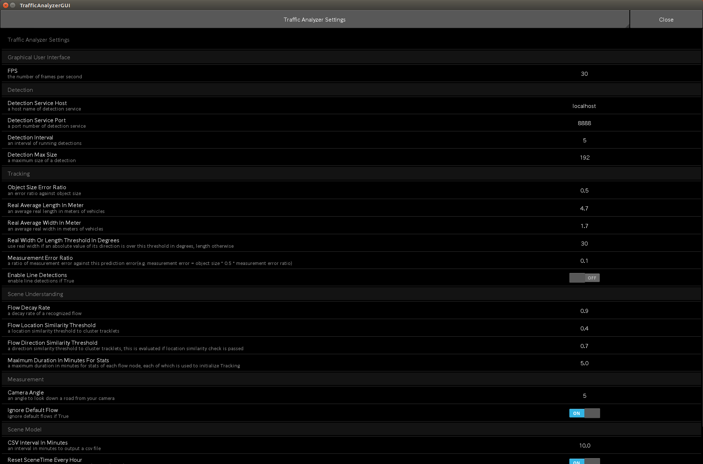
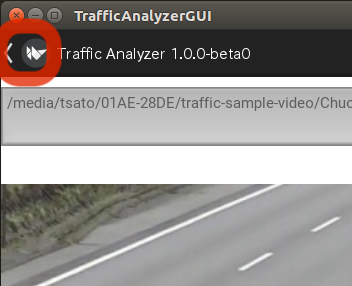

第2章　設定
=================

ここでは、交通量計測システムのGUIプログラムを通して設定可能な、各種設定の詳細について説明します。

まずは設定を表示、変更させる設定パネルについて説明し、その後、交通量計測の流れに沿って、各ステージにおけるポイントを挙げながら説明します。

====================
設定パネルについて
====================

まず、各種設定は、GUIプログラムの設定パネルで確認、変更を行います。
設定パネルは、GUIプログラムを起動後、F1ボタンを押すことで表示、非表示の切り替えをすることができます。

設定項目一覧

* Graphical User Interface

================  =====
項目名             説明    
================  =====
Window Width      GUIプログラムウィンドウの幅
Window Height     GUIプログラムウィンドウの高さ
FPS               GUIプログラムの表示用FPS
================  =====

* Detection

======================  =====
項目名                   説明    
======================  =====
Detection Service Host  車両検出サービス実行ホスト名
Detection Service Port  車両検出サービス実行ポート番号
Detection Interval      車両検出サービス実行インターバル（何FPSに一回検出サービスを実行するか）
Detection Max Size      車両検出最大サイズ（検出矩形の幅または高さのうち大きい方の最大値、単位ピクセル）
======================  =====

* Tracking

==========================================  =====
項目名                                       説明    
==========================================  =====
Object Size Error Ratio                     車両矩形サイズに対する追跡予測誤差許容値割合
Real Average Length In Meter                平均車両の実際の長さ（単位メートル）
Real Average Width In Meter                 平均車両の実際の幅（単位メートル）
Real Width Or Length Threshold In Degrees   速度計算において使用する実際の長さと幅の切り替え閾値（単位度）
==========================================  =====

* Scene Understanding

==========================================  =====
項目名                                       説明    
==========================================  =====
Flow Decay Rate                             認識された車線の減衰率
Flow Location Similarity Threshold          車線同士の統合、または追跡車両の車線割り当てにおける位置類似度閾値
Flow Direction Similarity Threshold         車線同士の統合、または追跡車両の車線割り当てにおける方向類似度閾値
Maximum Duration In Minutes For Stats       交通シーンの統計情報を保存する最大時間（単位分）
==========================================  =====

* Measurement

==========================================  =====
項目名                                       説明    
==========================================  =====
Camera Angle                                カメラの見下ろし角（単位度）
Ignore Default Flow                         計測結果の出力に、ユーザーが名前をつけた車線以外の追跡車両を含めないかどうか
==========================================  =====

* Scene Model

==========================================  =====
項目名                                       説明    
==========================================  =====
CSV Interval In Minutes                     CSV出力のインターバル（単位分）
==========================================  =====

* Camera Reader

==========================================  =====
項目名                                       説明    
==========================================  =====
Rotation Angle                              カメラ入力映像の回転（0, 180から選択）
==========================================  =====

================
解析画角の設定
================

まず最初に設定するのが解析画角ですが、ちょっとした工夫で、全体の設定を楽にすることができる、非常に重要な設定です。

通常カメラの画角設定は、道路や工事の条件などで、思い通りにはなりません。
そうして制約の中で設定されたカメラの画角に対し、計測対象となる交通フローを、カメラの画角の中の特定の位置で狙い撃ちするのが、この解析画角の設定です。

もしこの後の設定がうまくいかないと思ったら、解析画角の設定をやり直してみてください。
基本的に解析画角がうまく設定できていれば、特に設定をいじらなくてもうまくいくと考えてください。

カメラの画角設定のポイントは以下の4点です。

#. できるだけ高いところに設置する（交差点に設置する場合の目安は7m）
#. カメラの見下ろし角度をできるだけ大きくする
#. できるだけ歪みのないレンズを使用する
#. できるだけ計測対象車両が重ならないようにする

解析画角の設定で重要なポイントは以下の2点です。

#. 計測対象の車両サイズが、最小で50x50、最大で192x192程度に収める
#. 計測対象を絞る（交差点全体よりは特定の流入または流出）

また、消費者向けの一般的なビデオカメラを使用する場合は、
さらに以下のようなポイントがあります。

#. 解像度は低くて良い（ビットレートも低くて良い）
    解像度が低い方が、個々の車両は鮮明に映るため、
    720pまたは最悪VGAサイズまで、解像度はできるだけ下げる。

#. 車両は見える必要がある
    ビデオカメラのシャッタースピードは遅めに固定されていて、
    個々のフレームを見ると移動体がブレているのが一般的です。
    この状態で高速に移動する車両を真横から撮影すると、
    シャッタースピードの問題でブレ過ぎになり、
    そもそも検出されなくなります。
    また、圧縮の影響や夜間などのせいで背景と車両の境界が見えない場合、
    同様に検出されなくなります。
    できるだけ車両の移動方向にズームして撮影してください。

解析画角を設定したら、Start Learningボタンを押して学習を開始させます。
学習画面の様子をしばらく確認してから、解析画角の設定をやり直したくなった場合は、学習中にウィンドウ左上隅の「<」ボタンをクリックすると、解析画角設定画面に戻ることができます。

* Camera Reader/Rotation Angle

もしカメラの画角の入力を180度反転させたい場合は、この設定を利用してください。選択可能な値は0か180です。

================
学習の設定
================

学習を開始したら、以下のフローが正しく機能しているか、チェックしてください。

#. 車両を検出する（車両の種類は検出と同時に判定）
#. 検出された車両を、以降のフレームでも検出し、同一車両として追跡する
#. 追跡された車両の軌跡から車線を認識する

これらの項目に関する設定について、以下に説明します。

----------------
検出に関する設定
----------------

車両の検出は交通量計測の開始点であり、この精度は以降のフローに大きな影響を与えます。

^^^^^^^^^^^^^^^
GUIプログラム
^^^^^^^^^^^^^^^

    車両の検出枠は、青の矩形で表示されます。ただし追跡中の車両の矩形は緑で表示されますので、青の検出枠がよく見える時は、うまく追跡できていないと考えてください。

* Detection/Detection Interval

車両の検出は、フレーム画像の画像解析で行われていますので、少なくともフレーム画像で車両が見えなくてはなりません。

つまりカメラのレンズの問題で光学的に見えない場合は、フレーム画像にも車両が映らないため、車両が検出できなくなります。夜間の映像でよくあることとしては、カメラのシャッタースピードが遅い場合や、映像の圧縮方式が視聴用で高圧縮率の場合、映像としては見えるような気がしても、各フレームの画像を見てみると、車両がはっきり映っておらず流れていたり、背景に溶け込んでしまうことが挙げられます。

また、検出ができるようになったら次に確認するのが、検出枠がどれだけ安定して車両を正確に捉えられるか、という点です。各フレームに映る車両の画質が低下するにつれて、検出枠の大きさ、位置、にズレが生じるようになります。車両の位置は検出枠から求められているため、この誤差が追跡に影響を与えてきます。ごく僅かなズレでも、1フレームあたりの車両の移動量もごく僅かなため、この検出精度も重要な要素になります。

もし検出される頻度が少ない、若しくは精度が低下する場合は、まず車両検出サービスの実行頻度を上げてください。デフォルトは5フレームに1回ですが、これを小さい値、例えば2にすると、2フレームに一回、車両検出サービスが実行され、検出精度の低下を頻度の向上で補います。

なお、検出はGPU負荷の高い処理ですので、実行速度と精度のトレードオフとなります。逆に言うと、検出頻度と精度が高い場合は、さらに実行頻度を下げることで、実行速度を向上させることができます。

* Detection/Detection Max Size

そもそも検出されない場合、そうした対象車両の大きさを確認します。

解析画角の設定のポイントで挙げましたが、検出対象の車両は50x50から192x192程度のサイズに収まる必要があります。ただしこの192という最大値の設定は、この設定で変更させることができます。

512など大きな値を設定することも可能ですが、大きくなるほど、車両の一部だけを車両と誤認識してしまったり、そもそも解析画角サイズに比べて大き過ぎるため、車線の認識が困難になりますので注意してください。

----------------
追跡に関する設定
----------------

交通量計測システムの要である追跡は、車両検出サービスからインターバルで取得される検出枠を位置情報の手がかりとして、各車両の動きを予測して行います。

本予測モデルは、映像に映っている現場の3次元情報を復元するのではなく、画面上に投影された2次元空間のモデルとなっています。

この場合、画面上の動きには、実際の動きと比べて以下のような違いが生じます。

#. 遠いものほど小さく映る
    * 車両がカメラから離れるにつれて車両のサイズ（検出枠）が小さくなる
        * 車両がカメラから離れるにつれて画面上の移動速度が小さくなる
#. レンズの焦点から離れるほど小さく映る
    * 車両が焦点の位置から離れるにつれて車両のサイズ（検出枠）が小さくなる
        * 車両が焦点の位置から離れるにつれて画面上の移動速度が小さくなる
#. カメラの見下ろし角度が小さいほど画面上の移動量に対する実際の移動量の比率が大きくなる
    * 例えばほぼ正面から車両を見る場合、見下ろし角は非常に小さくなるが、車両の移動量に比べて、見た目の車両の変化は非常に小さくなる

本予測モデルでは、こうした実際の動きと画面上の動きの違いから生じる予測誤差と、位置情報の手がかりとなる車両の検出枠と実際の車両のズレから生じる観測誤差の両方を、効率的に考慮させることができるように設計されています。

^^^^^^^^^^^^^^^
GUIプログラム
^^^^^^^^^^^^^^^

    車両の推定位置を赤の点で表示し、それを基準にした推定サイズを緑の矩形で表示しています。追跡中の車両ラベルは、車両ID@最終検出時刻(車両の種類)というフォーマットになっています。

    また、赤の点を中心とする青い円は、X方向、Y方向、それぞれについての標準偏差の3倍を半径としており、推定位置が約99%の確率で存在する円を表しています。つまりこの円が小さい方が予測精度が高いことを表しています。この円が大きくなったり小さくなったりを繰り返すのは、インターバルによる影響です。車両検出サービスから最新の位置情報を取得したときは推定位置の精度が高くなり、円は小さくなりますが、その後新しい入力情報が入らない状態で予測を繰り返す毎に精度は低下するため、円が大きくなります。インターバルでこれが繰り返されるため、大きくなったり小さくなったりします。なお、車両の矩形が赤で表示されているのは、車両が解析画面から退出中という意味で、追跡中であれば追跡を終了し、未追跡であれば追跡は行いません。

    追跡がうまくいっているかどうかの指標として、Data Association Success Rate(DASR)というのを用意しています。これは過去一定時間における、総車両検出枠数に対する追跡中の車両への割り当て成功回数で、0.8を超えると良好です。解析対象外の車両が解析画角の隅を通過する場合、退出中の車両が停車している場合など、計測自体に影響を与えない場合でもこの数字が低下することは良くあります。第１章の以下の例は、解析対象外の車両が解析画角の隅を頻繁に通過する例で、0.7前後までDASRが低下していますが、計測には問題ありません。

    .. image:: images/chapter2/2-dasr.png
       :align: center

* Tracking/Object Size Error Ratio 

予測誤差と観測誤差の両方から生じる予測とのズレを、どの程度織り込むかを、その時の車両のサイズの比率で指定します。

技術的には、X方向、Y方向それぞれについて、その時の車両のサイズにこの設定値をかけたものの1/3を標準偏差σとして、以下のパラメーターでカルマンフィルターによる追跡を行います。なお、d=0.1、c=0.5で現在のところ固定されています。刻々と変動する車両の大きさに対応するため、この標準偏差も刻々とアップデートされています。

    * x

    .. image:: images/chapter2/2-math_x.png 
       :align: center

    * P

    .. image:: images/chapter2/2-math_P.png
       :align: center

    * F

    .. image:: images/chapter2/2-math_F.png
       :align: center

    * Q

    .. image:: images/chapter2/2-math_Q.png
       :align: center

    * H

    .. image:: images/chapter2/2-math_H.png
       :align: center

    * R

    .. image:: images/chapter2/2-math_R.png
       :align: center

* Tracking/Real Average Length In Meter, Real Average Width In Meter, Real Width Or Length Threshold In Degrees

目標物のない場所でも速度計測を可能にするため、これらの設定値を使用して、画面上の移動距離と実際の距離の換算を行います。

Real Width Or Length Threshold In Degreesをラジアンに変換したものをrwltラジアンとする場合、車両の移動方向に応じて、以下のようにReal Average Length In MeterまたはReal Average Width In Meterを使用します。

=================  =====
車両の移動方向       Width/Length    
=================  =====
0 ~ +rwlt          Length
+rwlt ~ (pi-rwlt)  Width
(pi-rwlt) ~ pi     Length
0 ~ -rwlt          Length
-rwlt ~ (rwlt-pi)  Width
(rwlt-pi) ~ pi     Length
=================  =====

ある地点を通過した車両の平均サイズをこの値と換算し、さらにMeasurement/Camera Angleを考慮した上で、1ピクセルあたり何メートルに相当するかを計算しています。

-----------------------------
交通シーン解析に関する設定
-----------------------------

交通シーンの解析の主なタスクは、統計情報の取得と車線の認識です。

統計情報の取得とは、追跡開始時の速度や加速度を、X方向とY方向それぞれについて、妥当な値に初期化するために、事前に準備する作業です。学習開始時にはこうした統計情報がありません。従って、車両が検出されても、その車両がX方向、Y方向、どちらの方向にどれぐらいの速度、さらには加速度で移動するのか、全く検討がつきません。

統計情報は、解析画角の各ブロックにおいて収集されます。ブロックとは、解析画角を縦20x横30の領域に分割した各領域のことで、この中では車両の大きさの変動がほとんどないものとみなされます。このため、車両の見かけの大きさが刻々と変動する場合、車両の移動速度も刻々と変化してしまいますが、このブロック内では一定であるとみなせる程度の大きさの変化量ですので、統計情報が利用できるようにしています。現時点では、このブロック数は固定になっています。

車線の認識とは、追跡された車両の軌跡をクラスタ化し、クラスタ化された軌跡の集合を代表的な軌跡として、車線として認識させることです。従って、何ら道路情報、例えば白線などの情報は必要としませんが、学習中に通過する車両があることが前提となります。

* Scene Understanding/Flow Location Similarity Threshold

物体の軌跡のクラスタ化は、軌跡を点として捉える場合はそれらの類似性で、軌跡を領域としてとらえる場合はその重なり割合で、評価をすることが一般的です。車両の軌跡は、点の軌跡として捉えることもできますし、車両の大きさも考慮して領域で捉えることもできます。しかしながら、実際の道路を走行する車両は、厳密な線の上を走るのではなく、車線の内側を自由に走っているものですので、本システムでは領域として捉えています。

ある車線の領域に対して、車両の軌跡の領域が重なっている割合が、この設置値を超える場合、その車両はこの車線に属すると見なされます。つまりデフォルト値である0.4の意味は、ある車両の軌跡の領域が、ある車線と40%以上領域が重なっていれば、その車両はこの車線を走行したとみなす、ということになります。

* Scene Understanding/Flow Direction Similarity Threshold

車線を領域だけで判定するのには問題があります。分かりやすい例で言えば逆走です。逆走は滅多にありませんので、実用上問題ないかというとそうでもなく、解析画角内では、特に右折車線の場合、車線の一部しか映らないものがよくあります。この領域を通過するのが、交差点の別方向の右折車両で、領域だけの類似性では、これらを区別できないことがよくあります。

本来車線には移動する向きがありますので、この類似性を考慮するのがこの設定値で、ズレが180度の場合の類似性は0、0度の場合の類似性は1.0となります。デフォルト値の0.7とは、0.7 = (1.0 - ズレ/pi)の意味ですので、ズレ=0.3*pi=54度という意味で、+-54度の差であれば同一と見なします。デフォルト値が大きな値になっているのは、多様な経路を取る右折車を考慮したものです。

なおこれは、領域の類似性をパスしたものに対してのみ評価されます。

* Scene Understanding/Flow Decay Rate

道路の映像を見ていると、いかに自由に車両が走行しているか、よく驚かされます。これは追い越しや車線変更など自主的なものもありますが、交差点付近では停車車両も頻繁に発生しますので、走行経路が一時的に変化することがよくあります。こうした混沌とした状態の中では、本来車線でないものを車線として認識することがあります。逆にこうした軌跡を無視してしまうと、頻度の低い車線が認識されなくなります。

本システムでは、車線は積極的に認識し、それを徐々に減衰させることで、一時的に発生した事象によって認識された車線は、消えるようにしています。この設定値が、この車線の減衰率になります。滅多に通過しない貴重な車両の軌跡から認識された車線に消えて欲しくない場合は、この設定値を小さくしてください。

* Scene Understanding/Maximum Duration In Minutes For Stats

収集した統計情報を最大何分に亘って保存するかの設定値です。

====================
計測に関する設定
====================

計測に関する設定は、以下の計測結果の出力に関するものです。

* Measurement/Camera Angle

計測結果には車両の平均移動速度（km/h）が含まれますが、これに大きな影響を与える設定値であり、速度計測の補正のための設定値です。

画面上の毎秒あたりのピクセル数を実際の距離に変換するには、カメラのアングルが大きな影響を与えます。真上から移動する車両を撮影した場合、つまりカメラの見下ろし角が90度の場合は、ピクセルをそのままメートルに換算できます。しかし、カメラの見下ろし角が小さくなるにつれて、画面上の移動距離に対する実際の移動距離は大きくなってきます。

車両の平均移動速度の精度を上げるには、どの車両も一定の見下ろし角になるようにするのがポイントです。

* Measurement/Ignore Default Flow

defaultの車線の車両の計測を結果に含めるかどうかの設定で、デフォルトではTrue、つまり計測結果に含めないようになっています。

* SceneModel/CSV Interval In Minutes

CSVファイルを出力する間隔の設定値で、単位は分です。デフォルトでは10分間隔で出力します。